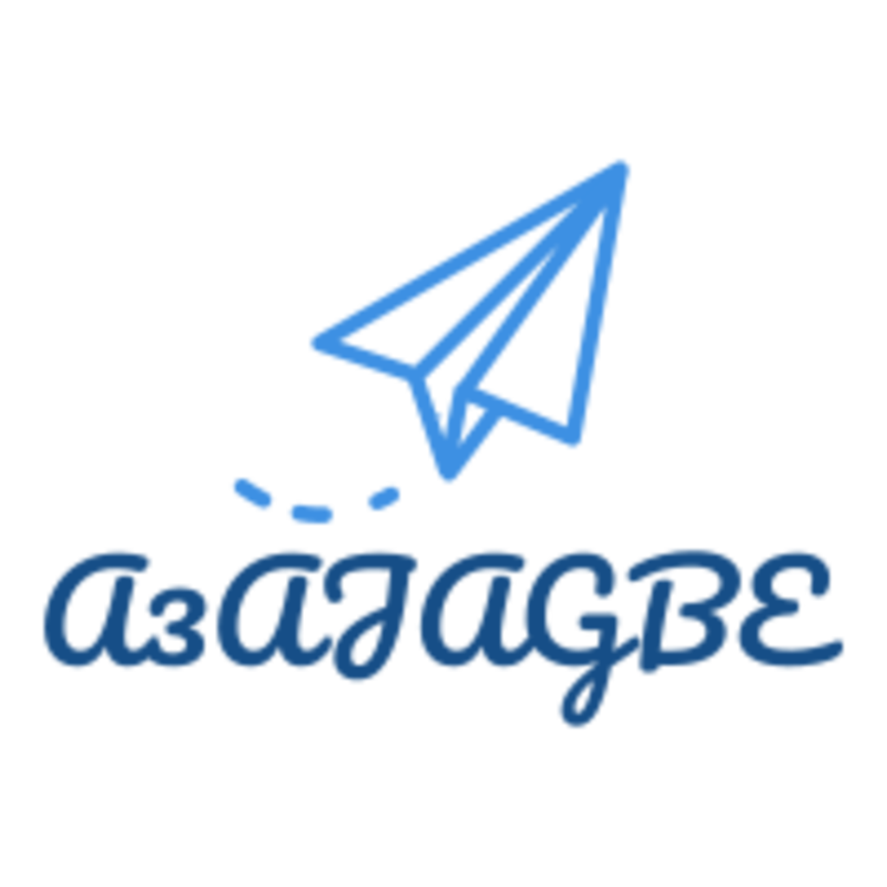
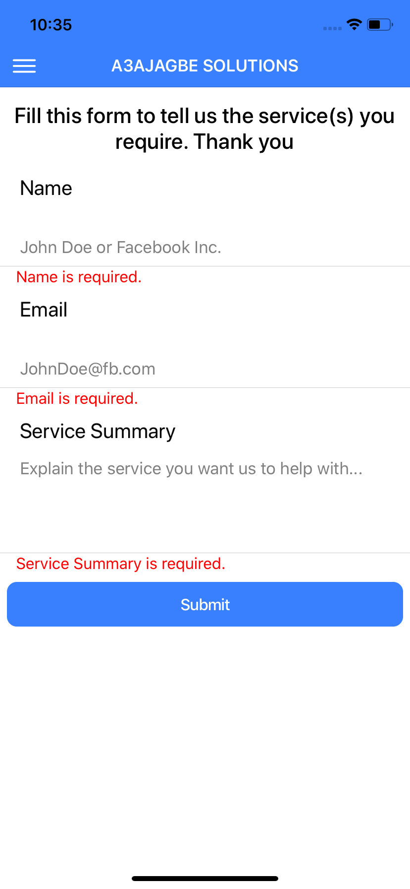
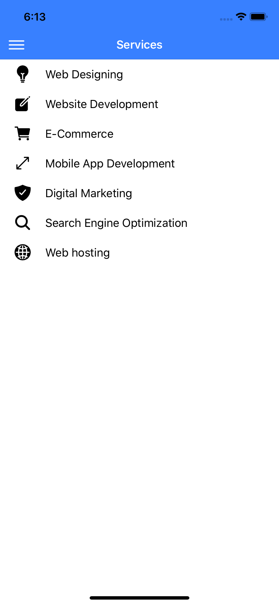
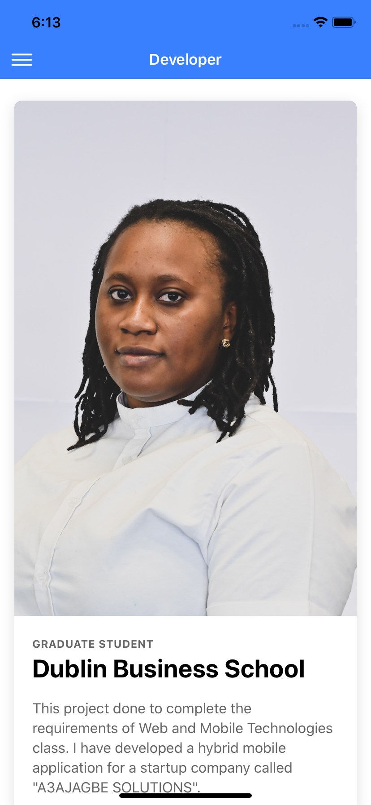

# A3AJAGBE
This is an hybrid application for "A3AJAGBE SOLUTIONS" developed using IONIC FRAMEWORK, ANGULAR and CORDOVA.
I have implemented a Splash Screen suitable for the application and platformLaunchNavigator, Geolocation, and CallNumber Plugins to the app, this is in addition to the default plugins.
The application is user friendly, consistent, error free and touch friendly and it's been tested on an ios device (iPhone Xs Max) and viewed on an emulator (Xcode)

## Images of the application on an emulator

